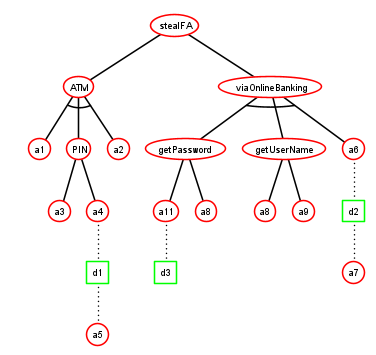
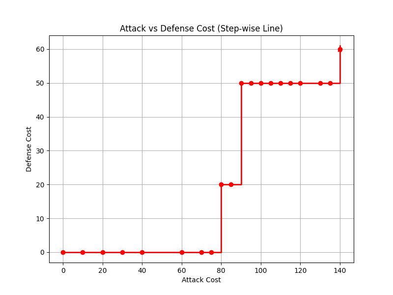

# 🛡️ ADTransformer

**A tool for security analysis of Attack-Defence Trees via model checking and trade-off exploration**

---

## 📌 Description

**ADTransformer** is a hybrid toolchain for the formal analysis of **Attack-Defence Trees (ADTs)**.  
Its main goal is to support **automated reasoning about trade-offs** between attacker and defender strategies using **multi-objective analysis**.

The tool takes as input an XML model generated by [**ADTool**](https://satoss.uni.lu/members/piotr/adtool/), parses it into an intermediate representation, and then **translates the ADT into a PRISM model** for analysis via probabilistic model checking.

Optionally, ADTransformer can **automatically generate the Pareto front**, providing a visual and computational representation of trade-offs between conflicting attacker/defender objectives.

---

## 🧠 Key Features

- 🔄 **ADTool XML to PRISM** model transformation
- 🧮 **Multi-objective analysis** with PRISM model checker
- 📈 **Automatic Pareto Front generation**
- 🧩 Support for different attacker/defender cost and success metrics
- 🎯 Enables formal reasoning about **attack feasibility**, **defence cost**, and **security trade-offs**

---

## ⚙️ Tech Stack

| Component         | Description                              |
|------------------|------------------------------------------|
| `.NET (C#)`       | ADTool XML parser and PRISM generator    |
| `Python`         | Pareto Front generation and visualization |
| `PRISM`          | Probabilistic model checker backend       |

---

📊 Example Output
✅ Transformed PRISM model (MDP or DTMC)

🧾 Rewards or costs defined for attacker/defender actions

📉 Pareto front of cost vs. success probability

📊 CSV file with raw results for post-analysis

*Example Model:*

*Pareto Front:*

[**Generated PRISM code:**](ADTransformer/GeneratedPrismFiles/generatedSample.prism)

---

🎯 Goals
ADTransformer is designed to:

Assist researchers and engineers in formally evaluating ADTs

Enable quantitative analysis of attacker/defender interaction

Automate the bridge between graphical modeling and formal verification

Support decision-making under uncertainty and conflicting objectives
