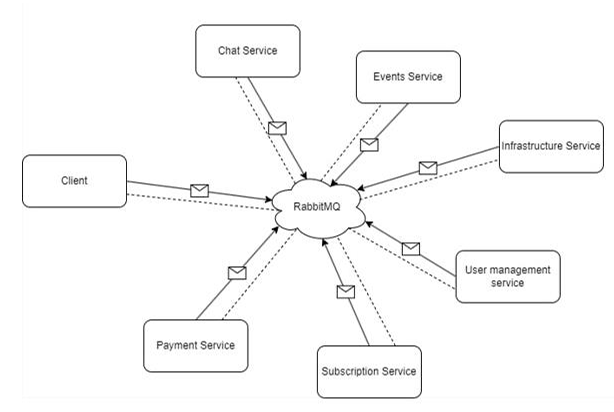
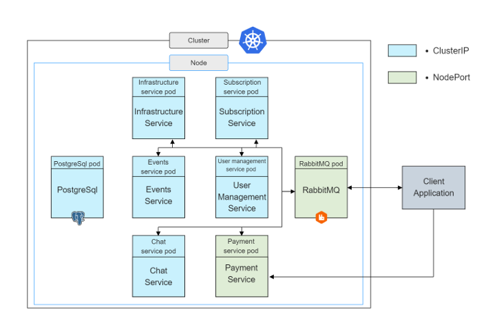

# 🏋️‍♂️ Online Sports Center System

> **Microservices-based architecture project**  
> Developed as part of the Service-Oriented Architecture (SOA) course  

---

## 🧠 Project Overview

The **Online Sports Center System** is a service-oriented platform that streamlines access to sports facilities, subscriptions, events, and community interactions. Built using **Java Spring Boot**, **RabbitMQ**, and deployed in a **Kubernetes cluster**, the system prioritizes **scalability**, **resilience**, and **user engagement**.

---

## ⚙️ Tech Stack

- **Backend Framework**: Java Spring Boot (6 microservices)
- **Frontend**: C# WinForms Client (.NET Framework 4.8)
- **Messaging System**: RabbitMQ
- **Database**: PostgreSQL (1 DB per microservice)
- **Architecture**: Microservices (SOA)
- **Deployment**: Kubernetes
- **Communication**: Asynchronous (message queue) + REST (sync where required)

---

## 🧩 Microservices Overview

### 1. 👤 User Management Service
Handles:
- Registration / Login / Logout
- Tracks logged-in users
- Central authority for verifying user identity

[Code](src/UserManagementService/springboot-app/src/main/java/com/UserManagementService/springbootapp)

### 2. 💳 Subscription Service
Manages:
- List of subscriptions
- Purchasing logic (interacts with Payment Service)
- Verifies user access to services

[Code](src/SubscriptionService/springboot-app/src/main/java/com/SubscriptionMicroservice/springbootapp)

### 3. 🧾 Payment Service
Processes:
- Subscription payments
- Stores transactions
- Exposes NodePort for direct REST communication

[Code](src/PaymentService/PaymentService/src/main/java/SOA_Microservices/PaymentService)

### 4. 🏟 Infrastructure Service
Controls:
- Viewing halls and their schedules
- Booking visits to facilities
- Validates user access and capacity

[Code](src/InfrastructureService/springbootapp/target/classes/com/InfrastructureService/springbootapp)

### 5. 🗓 Event Service
Features:
- Creating/registering for events
- Checks hall availability through Infrastructure Service

[Code](src/EventsService/springbootapp/target/classes/com/EventsService/springbootapp)

### 6. 💬 Chat Service
Supports:
- Thematic chat rooms
- Message posting and listing
- Fosters a sports center community

[Code](src/ChatService/springbootapp/target/classes/com/ChatService/springbootapp)

---

## 🖥 Client Application

- Built in **C# (WinForms)**
- Acts as a UI microservice (outside Kubernetes cluster)
- Connects to **RabbitMQ** and listens for responses on a unique queue using GUID
- Mixes **asynchronous messaging** and **synchronous REST** where needed (e.g., payment flow)

[Code](src/WPF_Client)

---

## 🔄 Communication Flow

- **RabbitMQ** is the central message broker
- All services are registered with their own exchanges
- Client has a dedicated queue and exchange (`direct`)
- Services use **fanout** exchanges for broadcasting

Communication is mostly **asynchronous**, ensuring UI responsiveness and non-blocking operations, with **synchronous REST** used for payment steps.

---

## 🚀 Deployment

- Deployed using **Kubernetes**
- Services are Dockerized and defined in Helm/Manifests
- **Cluster Components**:
  - 6 microservices (Spring Boot)
  - RabbitMQ (NodePort)
  - PostgreSQL instances (one per service)
  - Payment Service (NodePort)
- Services (except Payment & RabbitMQ) use **ClusterIP** for internal traffic

---

## 🧪 Testing

- **Manual testing** was extensively performed to validate all functional flows, including:
  - Authentication
  - Subscription flows
  - Facility bookings
  - Event participation
  - Chat communications

---

