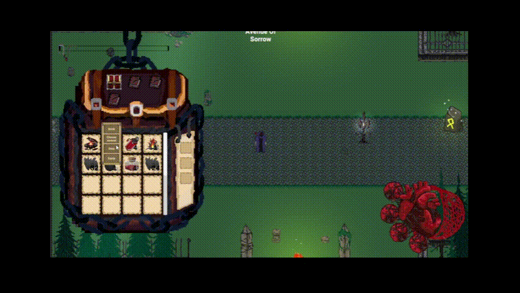
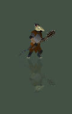
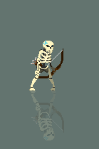
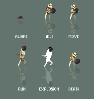
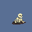

# 🕹️ Unseen Ancients: Top-Down 2D Adventure

**Unseen Ancients** is a 2D top-down action-adventure game built with **Unity**, combining dark fantasy aesthetics with rich gameplay systems. The game is designed with modular, expandable systems and hand-crafted visuals, including custom enemy animations and interactive mechanics.

## 🛠️ Tech Stack

- **Engine**: Unity 2022+
- **Language**: C#
- **Animation**: Unity Animator & custom 2D sprite sheets
- **UI**: Unity UI Toolkit (or legacy UI)

## ⚙️ Core Features

### 🎒 Inventory System
- Fully dynamic drag-and-drop inventory UI
- Item pickup, drop, stack, equip, and use functionality
- tooltips, and quickslot hotkeys

Inventory scripts you can see [here](https://github.com/AplyQ8/PixelQuasarCode/tree/main/Scripts/In%20Game%20Menu%20Scripts/InventoryScripts)

### ✨ Ability System
- Abilities are bindable to hotkeys
- Cooldowns, charges, and unique effects per skill
- Passive and active abilities integration

Scripts for ability system you can see [here](https://github.com/AplyQ8/PixelQuasarCode/tree/main/Scripts/Main%20hero/Abilities)

### 💰 Looting System
- Dynamic loot generation
- World drops, loot chests, and enemy drops
- Proximity-based or interact-based looting

A part of loot scripts you can see [here](https://github.com/AplyQ8/PixelQuasarCode/tree/main/Scripts/PickableObjects)

### 📜 Quest System
- Modular quest definitions via ScriptableObjects
- Multi-stage quests with objectives and rewards
- Journal UI and quest tracking

Quest scripts you can see [here](https://github.com/AplyQ8/PixelQuasarCode/tree/main/Scripts/QuestScripts)

### 🤖 Enemy AI
- Finite State Machines (FSM) for behavior control
- Patrol, chase, flee, and attack states
- Enemies react to visibility

Enemy scripts you can see [here](https://github.com/AplyQ8/PixelQuasarCode/tree/main/Scripts/Enemies)

## 🎨 Art & Animation

All enemy sprites and animations are drawn by hand. Below are samples of animations implemented in the game:

### 🧟‍♂️ Marauder Walk Animation

### ⚔️ Big Marauder All Animations

☠️ Skeleton — Walk & Attack

👑 Boss — Move & Attack

## 🚧 In Development

This project is still under development. Upcoming features include:
- Save/load system
- Boss fights
- More quests and biomes

## 🧑‍🎨 Authors

### [**AplyQ8**](https://github.com/AplyQ8)
- 🎨 Animations, Arts  
- 🧠 Code, Debug  
- 📖 Story Design, Storytelling  
- 🎮 Game Design

### [**Lanzy**](https://github.com/lanzy4)
- 🧠 Code, Debug  
- 🔊 Audio Design, Music  
- 🗺️ Level Design  
- 🎮 Game Design

### [**mirpapur**](https://github.com/mrpepperbest)
- 🎨 Animations, Arts
- 📖 Story Design, Storytelling

